# French and English conversation timing review

4 September 2026. Analysis of WebUI calls, source, bounded log metadata, current configuration, Pipecat documentation, and offline behavior probes.

**Conclusion:** The reported premature replies have credible, reproducible causes in the turn-management implementation. This is not just a prompt-quality issue. Substantially more natural conversations are achievable, but perfect human-equivalent turn prediction cannot be guaranteed. A person can pause after a complete sentence and then continue; neither a timer nor a model can know that future intention with certainty.

**Verified operating context**

- The local Studio API reports Antigravity Live STT, English recognition configuration, Antigravity Gemini LLM, Edge TTS, speculation enabled, and conversational reflexes disabled. The user reports the issue in both French and English.
- The process listening on local port 8090 runs Python 3.11, module `ai_bridge.web_server`, from this checkout. The separate installed Python 3.12 runtime differs and is not the identified Studio process.
- The API does not expose the numeric endpoint parameters. No listed timing overrides were found in the Studio process environment. The numeric values below are current source defaults, not measurements of pauses in customer audio or an introspection of already-loaded Python objects.
- In the last approximately 1.5 MB sampled from the voice-host log, 43 matching turn-commit records included 38 with `provider_final=False`; 13 Smart Turn decision records included five incomplete predictions. This sample spans sessions and versions, not one controlled call. It demonstrates that Smart Turn has been running and that the controller publishes turns without provider-final evidence; it does not measure the actual interruption error rate.
- Runtime settings and application code were left unchanged. Only analysis artifacts and offline probes were added. No new phone call, provider request for inference, or customer recording was made.

**Why the AI can answer too early**

1. **A pause is being promoted to a turn boundary too aggressively.** In [the active provider's endpoint calculation](/Users/aziz/Desktop/phone-agent-linux/ai_bridge/antigravity_live_stt.py:787), speculative mode defaults to 200 ms for concise/provider-final material and 350 ms for ambiguous material; transcript stability defaults to 100 ms. Grammar hints and Smart Turn may extend the wait, but ordinary clauses can still take the fast path. “Yes” or “oui” also bypasses the acoustic Smart Turn check. “Oui [pause] mais je voulais aussi…” is therefore vulnerable when the pause follows the first word. Provider-final means a recognition segment is final; it does not establish that the conversational idea is finished.

2. **Smart Turn does not have a reliable veto.** An incomplete prediction increases the default deadline to 1.4 seconds; it does not retain the turn until fresh completion evidence arrives. The adapter uses a 0.5 completion probability threshold, and prediction errors return a synthetic probability of 1.0, meaning complete. Pending inference can cease blocking after one second. These choices prioritize progress, but uncertainty can result in permission to speak. See [inference and endpoint handling](/Users/aziz/Desktop/phone-agent-linux/ai_bridge/antigravity_live_stt.py:749).

3. **There are actual timing races, not just unsuitable thresholds.** The watchdog measures silence before awaiting other work, then can reuse that stale value. Its commit routine validates transcript revision but not the latest acoustic activity/epoch. An offline probe resumed speech inside an awaited callback and observed the earlier turn still being published immediately afterward. Separately, when the caller starts while an answer is being prepared, user-start sets a flag but only interrupts if the bot is already marked speaking. If playback begins afterward, both flags can remain true without cancellation. See [watchdog](/Users/aziz/Desktop/phone-agent-linux/ai_bridge/antigravity_live_stt.py:887), [commit](/Users/aziz/Desktop/phone-agent-linux/ai_bridge/antigravity_live_stt.py:829), and [speech-start handling](/Users/aziz/Desktop/phone-agent-linux/ai_bridge/antigravity_live_stt.py:591).

4. **Interruption recognition waits for words.** Audio energy updates the speech clock, but the user-start timer begins only when a provider transcript arrives, then normally waits another 220 ms. A probe supplied 500 ms worth of high-energy PCM without a transcript and observed no user-start/interruption frame. This is a state-machine result, not a real-time ASR latency measurement. A person continuing their sentence should invalidate a pending reply before cloud transcription catches up.

5. **The upstream audio stream is modified during tiny pauses.** After 120 ms of detected silence, the watchdog queues an additional 200 ms of synthetic silence. A probe confirmed that it can queue this before already-captured audio remaining in the chunk buffer. That ordering is a concrete defect. Whether it causes particular provider-final events needs audio/provider tracing; it is plausible that the added gap encourages premature segmentation.

6. **Late revisions can turn one idea into multiple turns.** A cumulative extension of “Please change my address” to “Please change my address to London” stages “to London” as a new candidate even without a new acoustic epoch. That can cause separate answers to pieces of one request. The downstream semantic guard logs incomplete fragments but forwards them; it does not repair the ownership of that turn.

The custom path uses a fixed −42 dBFS energy threshold rather than a learned speech detector for its acoustic clock. Quiet syllables, breathy endings, noise and missing media require distinct handling. Simply lowering the threshold can make noise or echo take over the conversation, so this needs measured VAD/echo behavior.

**What the architecture should do instead**

There should be one authority for who currently has the conversational floor. Its decisions should distinguish speech activity, a provisional pause, a completed user turn, a prepared answer, and audible speech.

```mermaid
stateDiagram-v2
    [*] --> Listening
    Listening --> PossibleEnd: speech pauses
    PossibleEnd --> Listening: caller continues
    PossibleEnd --> AnswerReady: completion evidence sufficient
    AnswerReady --> Listening: caller resumes; cancel pending answer
    AnswerReady --> Speaking: recheck current turn and caller activity
    Speaking --> Listening: genuine interruption; flush output
    Speaking --> Listening: answer completes
```

Speculation can remain: compute possible answers during pauses, but do not let it shorten the permission-to-speak decision. On credible speech resumption, increment the input revision before awaiting anything, invalidate pending completion, cancel old LLM/TTS work, and stop queued stale audio. Check that revision again immediately before committing a transcript and before releasing audio. The existing transport flush/generation machinery is useful; it needs a reliable upstream trigger.

Use local speech detection to notice resumption, acoustic prosody to assess the pause, and linguistic/task context to assess whether the person has yielded. An incomplete or unavailable classifier result should mean uncertain, with a bounded waiting/recovery policy—not falsely confident completion. Do not add a second independent Pipecat turn controller beside the current one: either migrate to its supported strategy mechanism or make the custom controller the single authoritative implementation.

Handle continuation and interruption separately. If the AI has not audibly answered yet, append the resumed thought and regenerate from the full request. If it has spoken, interrupt and preserve what was actually delivered. Brief “mhm”, “oui”, or “right” while the AI explains something may be acknowledgements, whereas “non, attendez” or “actually…” may request the floor. Context and audio evidence should distinguish these cases.

**Initial tuning experiments after the race fixes**

These are starting ranges for controlled comparisons, not universal settings or promised performance:

| Situation | Candidate patience after speech stops |
|---|---|
| Clear answer to a closed question, completion evidence agrees | 350–600 ms |
| Ordinary completed sentence | 600–900 ms |
| Hesitation, unfinished clause, list/dictation, self-correction | 1.2–2.0 s, re-evaluated when evidence changes |
| Strong ongoing/incomplete evidence or uncertain audio | Continue listening; use a separate bounded idle/recovery policy |

Avoid imposing two seconds on every response. Also avoid using silence expiry alone as proof of completion. Recognition latency, reply preparation and phone playout add to the final audible delay; measure the combined result. French calls should have an appropriate French language profile, and mixed-language calls need explicit bilingual evaluation. The current English/French marker heuristics and asymmetric language-conflict delay are not sufficient proof of bilingual turn quality.

**How to prove improvement**

Create an annotated English/French replay set using synthetic scenarios and appropriately authorized recordings. Include “yes, but…”, “oui, mais…”, breathing, 300/600/1000/1500 ms mid-thought pauses, complete-sounding clauses followed by explanation, names/numbers/addresses, corrections, language switching, quiet speech, noise, echo, and genuine interruptions. Cover resumption during STT finalization, Smart Turn inference, speculative work, LLM generation, TTS, and queued playout.

Record acoustic onset/offset, frame-arrival continuity, provisional transcript revision, Smart Turn score and age, commit reason, cancellation revision, first audio sent, first playback acknowledgement, and final flush acknowledgement. Keep sensitive transcripts out of routine timing logs.

Measure premature audible replies, split/duplicate user turns, response delay after actual yielded turns, interruption-to-audible-stop time, missed short answers, and human ratings of feeling heard. Evaluate French and English separately, then mixed calls. A commit just before further speech is a candidate for review, not automatically an error: the listener may have reasonably believed the turn was over.

Reasonable initial acceptance objectives are zero failures in deterministic race/ordering tests, zero premature starts in the fixed hesitation suite, and a low annotated false-start rate in repeated real calls without excessive reply latency. Set numerical live-call budgets after measuring the existing system; do not claim human parity from a few successful calls or invented percentages.

**Validation artifacts and limits**

The [endpoint probes](/Users/aziz/Desktop/phone-agent-linux/reports/quality/turn-taking-review/offline_endpoint_probes.py) and [speech-release probes](/Users/aziz/Desktop/phone-agent-linux/reports/quality/turn-taking-review/speech_release_probe.py) were run locally and independently rerun during this review. They exercise synthetic state/frame interleavings without model inference or telephone calls. Results establish reachable implementation behaviors; they do not estimate their frequency in real conversation. The secondary local-STT interruption finding in the probe output does not apply to the currently selected provider.

Existing tests for speculation/reflex behavior passed in the delegated check. Policy tests could not reach their target behavior because of profile initialization/sandbox and identity-readiness failures; those are not evidence for or against the identified timing defects. No full-suite or new physical-call qualification is claimed.

Pipecat's current documentation explicitly separates VAD speech activity from conversational turn completion and describes turn strategies combining acoustic and transcription evidence. That supports the architecture above, while the specific defect findings come from this project's source and probes: [Speech Input & Turn Detection](https://docs.pipecat.ai/pipecat/learn/speech-input), [User Turn Strategies](https://docs.pipecat.ai/api-reference/server/utilities/turn-management/user-turn-strategies).

**Recommended order:** fix resumption/cancellation and audio ordering; separate speculation from speech release; make completion decisions combine current audio and language evidence; calibrate English/French behavior; then tune latency and conversational style. A more patient prompt or a more expensive LLM cannot independently repair these timing boundaries.
